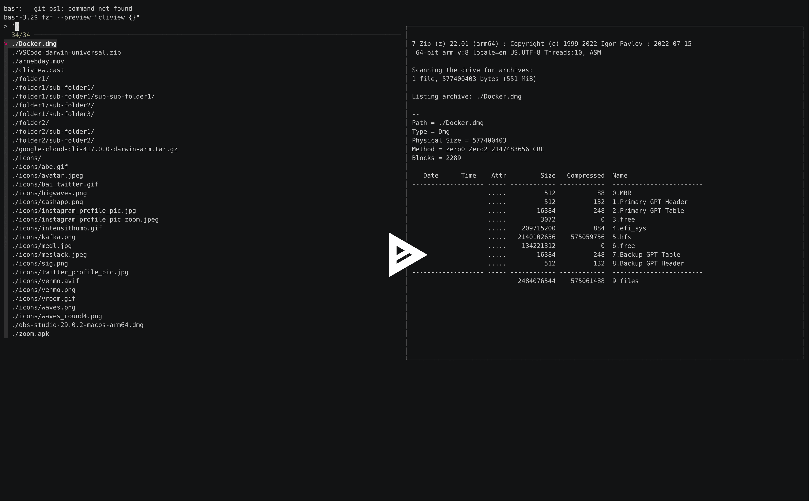

# cliview

Cliview is a command-line tool that allows one to customize views for any type of file (eg: zip bundles, images, directories, etc.). Think of it like OSX's "QuickLook" feature for the terminal.

The inspiration for this tool comes from [`fzf`](https://github.com/junegunn/fzf)'s preview feature. One ought to be able to run `fzf --preview="cliview {}"` and be rewarded with powerful previews across a wide range of file types.

# Demo

[](https://asciinema.org/a/eqWc58K2VtZO7WKzZJNymkmZM)

### Installation

See the [releases](https://github.com/kevin-cantwell/cliview/releases) page for binary releases.

Or `go install github.com/kevin-cantwell/cliview@latest`

### Configuration

The flexibility of the tool is derived from its configuration file, which allows one to customize "viewers", which are mappings of file types to shell commands that generate output. For example, directories (`inode/directory`) can be mapped to `tree` or `exa` instead of `ls` (the default). Images or videos can be mapped to `imgcat` or `timg` to render a colorized visualization.

How files are classified into types can also be customized. By default, a file's mime-type and extension are used to determine which viewer command is executed.

By default the config file is written to `$HOME/.cliview/config.yaml`. Edit this file to customize commands to your liking:

https://github.com/kevin-cantwell/cliview/blob/b22a94df77d065a1f309ef177f18ee1e730392b1/default-config.yml#L1-L22

### Usage

```
NAME:
   cliview - Preview any file type directly in the terminal.

USAGE:
   cliview [options] FILE

VERSION:
   0.1.0

COMMANDS:
   help, h  Shows a list of commands or help for one command

GLOBAL OPTIONS:
   --config value, -c value  The config file to use. (default: "/Users/kevin-cantwell/.config/cliview/config.yml")
   --explain, -e             Print the configured view command without executing it.
   --help, -h                show help
   --version, -v             print the version
```
